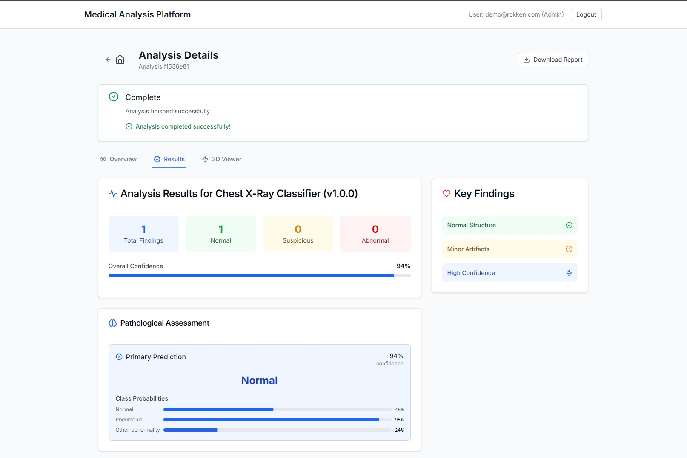

# Blueprint: Medical Image Analysis Platform

platform for medical image analysis with AI Model (mock for the moment), built with modern architectural patterns to ensure scalability, performance, and real-time interactivity. This project showcases a production-ready blueprint for healthcare applications, balancing developer ergonomics with enterprise-grade requirements.

---

## Overview



This platform enables medical image uploads, AI-driven analysis, and real-time result visualization. It's designed with clean separation of concerns, async-first principles, and a focus on developer-friendly workflows.

- **Live Frontend**: [https://reliable-moxie-d87614.netlify.app/](https://reliable-moxie-d87614.netlify.app/)  
- **Backend API Docs**: [https://medical-image-platform-production.up.railway.app/redoc](https://medical-image-platform-production.up.railway.app/redoc)

---

## Architecture

### Backend
Powered by **FastAPI**, the backend is async-native, handling everything from secure file uploads to AI inference. It uses **SQLAlchemy 2.0** (async mode) for scalable, audit-compliant data storage and **WebSockets** for real-time updates.

````mermaid
graph TD
    %% Frontend
    subgraph "User's Browser (Netlify)"
        A[Next.js Frontend]
    end

    %% Backend
    subgraph "Backend (Railway)"
        B[FastAPI Server]
        C[WebSocket Manager]
        D[(PostgreSQL Database)]
    end

    %% Flow
    A -->|1. Login / Upload | B
    B -->|2. Read / Write| D
    D -->|3. Return Data| B
    B -->|4. Return Response| A

    A <--> |5. Real-time Updates WebSocket| C
    B --> |6. Triggers Update| C

    style A fill:#007acc,stroke:#333,stroke-width:2px,color:#fff
    style B fill:#009688,stroke:#333,stroke-width:2px,color:#fff
    style C fill:#ffc107,stroke:#333,stroke-width:2px,color:#000
    style D fill:#9e9e9e,stroke:#333,stroke-width:2px,color:#fff
````

### Frontend
Built with **Next.js** and **TypeScript**, the frontend delivers a reactive, type-safe UI. **TanStack Query** optimizes data fetching, while **Tailwind CSS** ensures a responsive design. A WebGL-based `MedicalScanViewer` component is ready for rendering large medical scans efficiently.

### Infrastructure
The entire stack is containerized with **Docker** and configured for deployment on platforms like **Railway** (backend) and **Netlify** (frontend). It’s battle-tested on free tiers but ready for cloud platforms like AWS or Azure.

````mermaid
graph TD
    subgraph "User's Browser"
        A[Next.js Frontend on Netlify]
    end

    subgraph "Cloud Backend on Railway"
        LB(Load Balancer)

        subgraph "FastAPI Instance 1"
            B1[API Logic]
            C1[WebSocket Manager]
        end
        
        subgraph "FastAPI Instance 2"
            B2[API Logic]
            C2[WebSocket Manager]
        end

        subgraph "..."
            Bn[...]
            Cn[...]
        end

        subgraph "Shared Infrastructure"
            R[Redis Pub/Sub]
            DB[Database Postgres]
        end
    end

    A -->|1. API & WebSocket Requests| LB
    LB --> B1
    LB --> B2
    LB --> Bn

    B1 -->|Read/Write| DB
    B2 -->|Read/Write| DB
    Bn -->|Read/Write| DB

    B1 -->|2. Publish Update| R
    B2 -->|2. Publish Update| R

    R -->|3. Broadcast to ALL Instances| C1
    R -->|3. Broadcast to ALL Instances| C2
    R -->|3. Broadcast to ALL Instances| Cn

    C1 -.->|4. Send to User| A
    C2 -.->|4. Send to User| A
    Cn -.->|4. Send to User| A

    style A fill:#007acc,stroke:#333,stroke-width:2px,color:#fff
    style LB fill:#673ab7,stroke:#333,stroke-width:2px,color:#fff
    style R fill:#d82c20,stroke:#333,stroke-width:2px,color:#fff
    style DB fill:#9e9e9e,stroke:#333,stroke-width:2px,color:#fff

`````

---

## Key Patterns

- **Service/Repository**: Business logic lives in service layers, with repositories abstracting data access for cleaner, testable code.
- **Observer (WebSocket)**: Real-time updates push analysis status (e.g., PENDING → COMPLETE) to the frontend.
- **Middleware**: Security and audit logging are handled via FastAPI middleware, keeping business logic uncluttered.

---

## Performance & Scalability

- **Async I/O**: From database queries to file handling (via `aiofiles`), the backend avoids blocking the event loop.
- **Stateless API**: FastAPI’s stateless design enables horizontal scaling behind a load balancer.
- **Frontend Optimizations**: Next.js code-splitting and React Query’s caching keep the UI snappy.
- **3D Visualization**: The `MedicalScanViewer` uses WebGL and plans for Level of Detail (LOD) and Web Workers to handle large datasets without browser crashes.

---

## Getting Started

### Prerequisites
- Node.js 20+
- Python 3.11+
- Docker (optional, for containerized setup)

### Local Development

1. **Backend**:
```bash
cd backend
python -m venv venv
source venv/bin/activate  # or `venv\Scripts\activate` on Windows
pip install -r requirements.txt
uvicorn app.main:app --reload
```

2. **Frontend**:
```bash
cd frontend
npm install
npm run generate-api  # Regenerate API client if backend changes
npm run dev
```

3. **Docker** (Alternative):
```bash
docker-compose up --build
```

4. **Windows Workflow**:
Use the `dev.ps1` PowerShell script for streamlined development:
```powershell
Set-ExecutionPolicy -ExecutionPolicy RemoteSigned -Scope CurrentUser  # One-time setup
.\dev.ps1 start  # Build and run
.\dev.ps1 logs   # View logs
.\dev.ps1 down   # Tear down
```

---

## Deployment

### Backend (Railway)
1. Connect your GitHub repo to Railway.
2. Set environment variables:
   - `DATABASE_URL`: Provided by Railway’s PostgreSQL.
   - `CORS_ORIGINS`: Your Netlify frontend URL.
3. Push to deploy.

### Frontend (Netlify)
1. Connect your GitHub repo to Netlify.
2. Configure:
   - Build command: `npm run build`
   - Publish directory: `.next`
   - Environment variables:
     - `NEXT_PUBLIC_API_URL`: Railway backend URL.
     - `NEXT_PUBLIC_WS_URL`: WebSocket endpoint.

---

## Technical Roadmap

1. **WebSocket Scaling**:
   - Current: Single-instance WebSocket connections stored in memory.
   - Planned: Use Redis Pub/Sub for a distributed message bus, enabling multi-instance real-time communication.

2. **File Storage**:
   - Current: Local file storage for uploads.
   - Planned: Migrate to Amazon S3 or Google Cloud Storage with pre-signed URLs for secure, scalable file handling.

3. **ML Pipeline**:
   - Current: Mock AI analysis with realistic delays and status updates.
   - Planned: Integrate a real ML pipeline with Celery task queues, model registries (e.g., MLflow), and GPU support.

4. **Authentication**:
   - Current: Hardcoded demo user.
   - Planned: Full auth system with user registration, RBAC, and multi-tenancy for medical data isolation.

5. **Repository Pattern**:
   - Planned: Abstract SQLAlchemy queries into repository classes for better testability and database-agnostic logic.

---

## Demo Features

- ✅ Secure file uploads with progress tracking
- ✅ Real-time analysis updates via WebSocket
- ✅ Placeholder 3D scan visualization (WebGL-based)
- ✅ Type-safe API communication (TypeScript)
- ✅ Responsive UI with Tailwind CSS
- ✅ Comprehensive error handling
- ✅ Audit logging for compliance
- ✅ Dockerized for easy deployment

---

## Mock ML Pipeline

The current AI analysis is mocked to simulate:
- Processing delays (30-60s)
- Status transitions (PENDING → ANALYZING → COMPLETE)
- Confidence scores and structured outputs
- Error simulation for robustness

**To Productionize**:
1. Replace `mock_ai_analysis` in `analysis_service.py` with real model inference.
2. Integrate a task queue (e.g., Celery) and model registry.
3. Optimize for GPU/CPU resource management.
